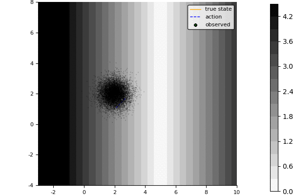
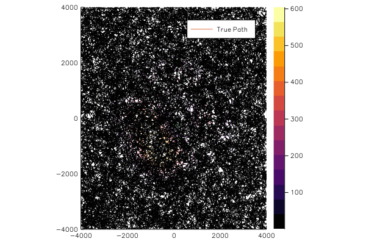
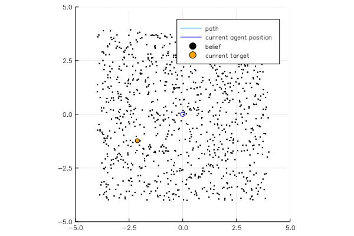

# POMDPGallery

[](https://travis-ci.org/JuliaPOMDP/POMDPGallery.jl)

A gallery of models written for [POMDPs.jl](https://github.com/JuliaPOMDP/POMDPs.jl) with visualizations. You should be able to copy and paste the code below each visualization to run it on your local machine.

For instructions on how to add new models, see [INSTRUCTIONS.md](INSTRUCTIONS.md).

## [LaserTag](https://github.com/zsunberg/LaserTag.jl)

LaserTag problem from Somani, A., Ye, N., Hsu, D., & Lee, W. (2013). DESPOT : Online POMDP Planning with Regularization. Advances in Neural Information Processing Systems. Retrieved from http://papers.nips.cc/paper/5189-despot-online-pomdp-planning-with-regularization. Versions with continuous and discrete observations.


```julia
try Pkg.clone("https://github.com/zsunberg/LaserTag.jl.git") end
Pkg.build("LaserTag")
Pkg.add("Reel")

using POMDPs
POMDPs.add("QMDP")

using LaserTag
using POMDPToolbox
using ParticleFilters
using QMDP

using Reel

rng = MersenneTwister(7)
pomdp = gen_lasertag(rng=rng)
policy = solve(QMDPSolver(), pomdp)
filter = SIRParticleFilter(pomdp, 10000)

frames = Frames(MIME("image/png"), fps=2)

print("Simulating and generating LaserTag gif")
for step in stepthrough(pomdp, policy, filter, "a,r,sp,o,bp", rng=rng)
    push!(frames, LaserTagVis(pomdp, step...))
    print('.')
end
println(" Done.")
write("out.gif", frames)
```


## [LightDarkPOMDPs](https://github.com/zsunberg/LightDarkPOMDPs.jl)

A 2D LightDark POMDP similar to the one at http://www.roboticsproceedings.org/rss06/p37.pdf . There is a version with a quadratic cost function, and one with a small target.




```julia
try Pkg.clone("https://github.com/zsunberg/LightDarkPOMDPs.jl") end
Pkg.build("LightDarkPOMDPs")
using POMDPs
using LightDarkPOMDPs

Pkg.add("Reel");            using Reel
Pkg.add("POMDPToolbox");    using POMDPToolbox
Pkg.add("ParticleFilters"); using ParticleFilters
Pkg.add("Plots");           using Plots
Pkg.add("PyPlot");

pomdp = LightDark2D()
filter = SIRParticleFilter(pomdp, 10000, rng=MersenneTwister(5))
policy = FunctionPolicy(b -> -0.3*mean(b))

sim = HistoryRecorder(max_steps=30, rng=MersenneTwister(7))
hist = simulate(sim, pomdp, policy, filter)

pyplot()
frames = Frames(MIME("image/png"), fps=2)
for i in 1:length(hist)
    v = view(hist, 1:i)
    plot(pomdp, xlim=(-3, 10), ylim=(-4,8), aspect_ratio=:equal)
    plot!(v)
    b = belief_hist(v)[end]
    plt = plot!(b)
    push!(frames, plt);
    print(".")
end
println()
write("out.gif", frames);
```


## [Powseeker](https://github.com/zsunberg/Powseeker.jl)

A backcountry skier wants to get the best possible run in. She has a map, but she can only get a noisy estimate of the gradient as she travels or take a costly break from travelling. The reward at each step is exponentially related to her speed. Most solution methods do not perform well on this problem.




```julia
try Pkg.clone("https://github.com/zsunberg/Powseeker.jl") end
using POMDPs
using Powseeker

Pkg.add("Reel");            using Reel
Pkg.add("POMDPToolbox");    using POMDPToolbox
Pkg.add("ParticleFilters"); using ParticleFilters
Pkg.add("Plots");           using Plots
Pkg.add("GR");              

pomdp = PowseekerPOMDP()
filter = SIRParticleFilter(pomdp, 10_000, rng=MersenneTwister(7))
policy = RandomlyCheckGPS(Topout(pomdp, 0.1), 0.2, MersenneTwister(12))

sim = HistoryRecorder(rng=MersenneTwister(94), max_steps=60, show_progress=true)
hist = simulate(sim, pomdp, policy, filter)

gr()
frames = Frames(MIME("image/png"), fps=2)
for i in 1:length(hist)
    v = view(hist, 1:i)
    plot(pomdp, xlim=(-4000,4000), ylim=(-4000,4000), aspect_ratio=:equal)
    plt = plot!(v)
    push!(frames, plt);
    print(".")
end
println()
write("out.gif", frames);
```


## [VDPTag](https://github.com/zsunberg/VDPTag.jl)

Van Der Pol Tag. The agent tries to catch a target that moves according to the [Van Der Pol equations](https://en.wikipedia.org/wiki/Van_der_Pol_oscillator#Two-dimensional_form). An observation with a noisy bearing to the target can be obtained for a cost, and the agent always moves one unit, but may choose any direction.




```julia
try Pkg.clone("https://github.com/zsunberg/VDPTag.jl") end
using POMDPs
Pkg.build("VDPTag");        using VDPTag
Pkg.add("Reel");            using Reel
Pkg.add("Plots");           using Plots
Pkg.add("GR");              
Pkg.add("ParticleFilters"); using ParticleFilters
Pkg.add("ProgressMeter");   using ProgressMeter
Pkg.add("POMDPToolbox");    using POMDPToolbox
Pkg.add("Distributions");   using Distributions

pomdp = VDPTagPOMDP()
filter = SIRParticleFilter(pomdp, 1000, rng=MersenneTwister(100))

hist = sim(pomdp, updater=filter, max_steps=100, rng=MersenneTwister(1)) do b
    # Policy: move towards predicted target position; if uncertainty area > 0.01, take measurement
    agent = first(particles(b)).agent
    target_particles = Array{Float64}(2, n_particles(b))
    for (i, s) in enumerate(particles(b))
        target_particles[:,i] = s.target
    end
    normal_dist = fit(MvNormal, target_particles)
    angle = action(ToNextML(mdp(pomdp)), TagState(agent, mean(normal_dist)))
    return TagAction(sqrt(det(cov(normal_dist))) > 0.01, angle)
end

gr()
frames = Frames(MIME("image/png"), fps=2)
@showprogress "Creating gif..." for i in 1:length(hist)
    push!(frames, plot(pomdp, view(hist, 1:i)))
end
write("out.gif", frames)
```


